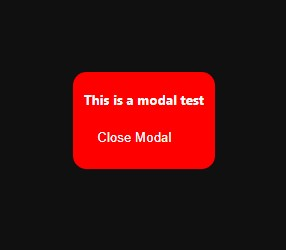

# Dialog Tag 

- The ```dialog``` tag it's designed for make a modal, that actually works without a ```.js``` file, with just two function inside the HTML:

```
Dialog tag: 

<dialog id="d" class="modal"> <!-- You can put whatever you want inside of it -->
    ...
</dialog>

To open:

<button onclick="d.showModal()">Open Modal</button>

To close: 

<button onclick="d.close()">Close Modal</button>
```

With this two, the modal will be functional, but not too fancy, so you can costumize it with CSS:

```
button {
    border-radius: 100px;
    background-color: red;
    color: #FFF;
    font-size: 20px;
    padding: 20px;
    border: 0;
}
main {
    background-color: #121212;
    height: 100%;
    width: 100%;
}
.modal {
    border-radius: 20px;
    border: 0;
    background-color: red;
}
.modal h1 {
    color: #FFF;
    font-size: 20px;
    font-family: system-ui, -apple-system, BlinkMacSystemFont, 'Segoe UI', Roboto, Oxygen, Ubuntu, Cantarell, 'Open Sans', 'Helvetica Neue', sans-serif;
}
```

You don't all the customization thing, but for test, I did a very simple, just to show how it works


